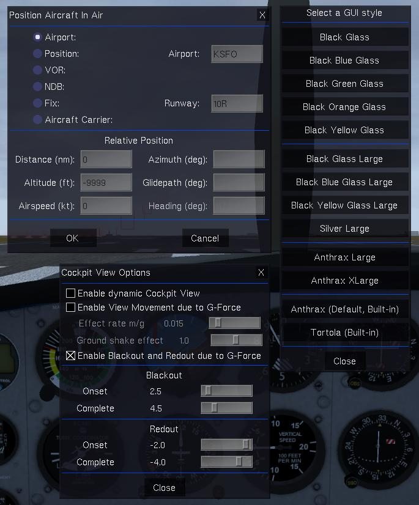
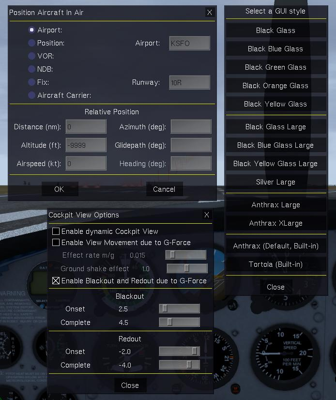
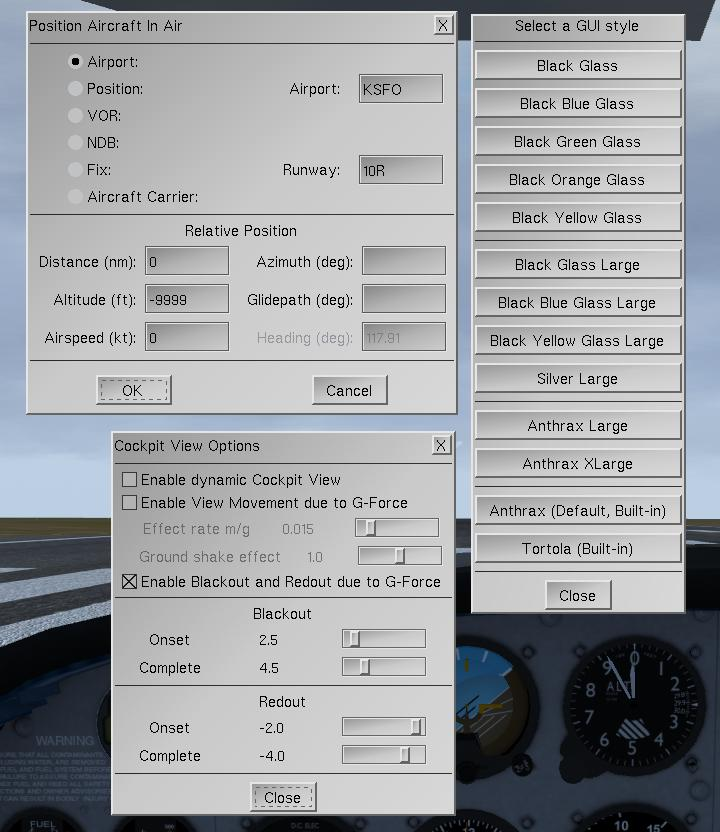
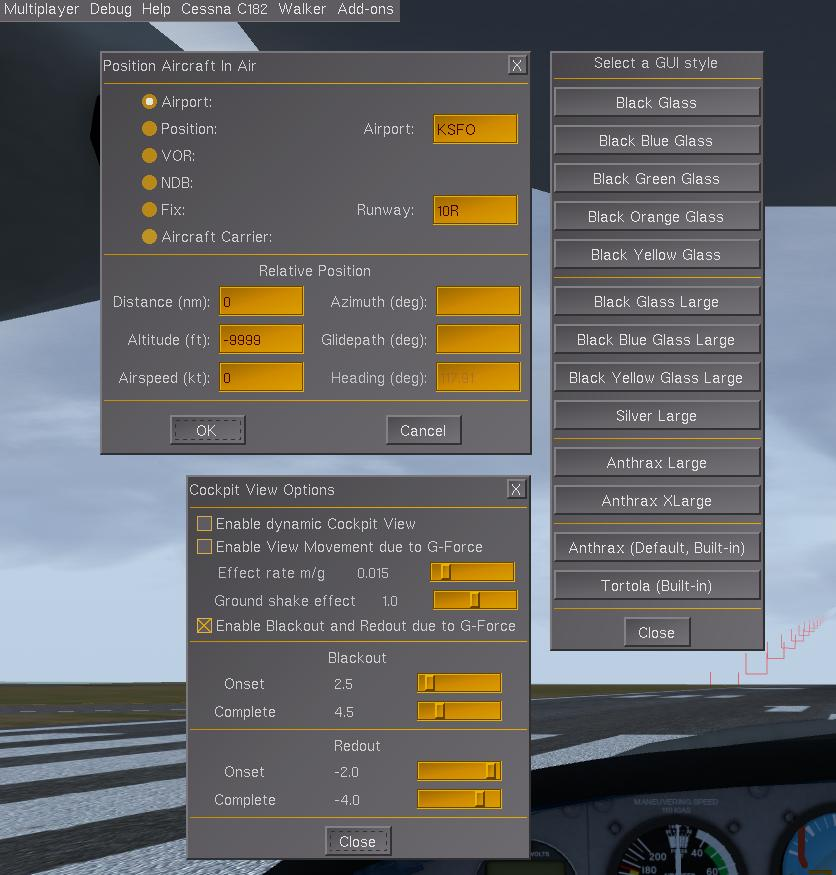
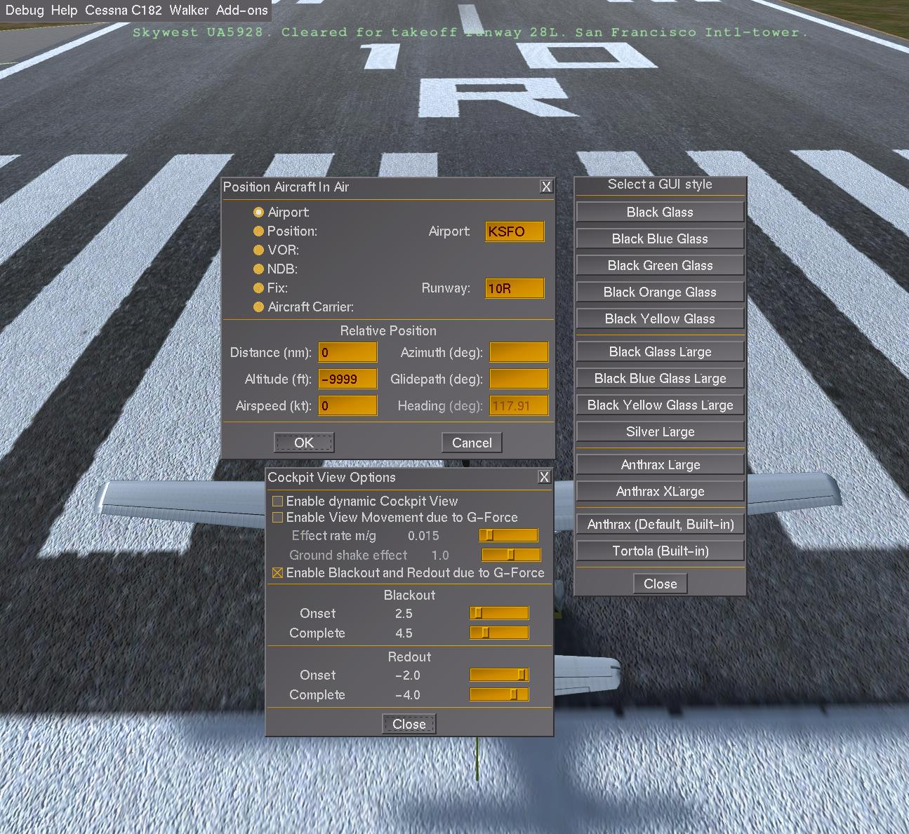

# AnotherGUIExtended
A fork of SP-NTX's [AnotherGUI](https://github.com/SP-NTX/AnotherGUI), which adds another GUI styles and a dialog to change style.

This fork adds multiple GUI styles, including ones with enlarged fonts, which are suitable for high-DPI screens.

## Preview

### Black Blue Glass

### Black Yellow Glass

### Silver

### Anthrax Large

### Anthrax XLarge
For very high DPI screens.

## Installation
See [wiki.flightgear.org/Addon#Installing_an_addon](https://wiki.flightgear.org/Addon#Installing_an_addon) for instructions.
